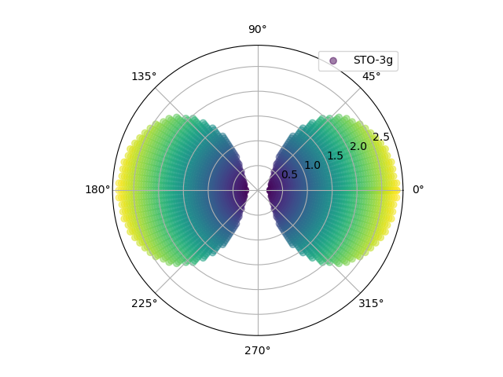
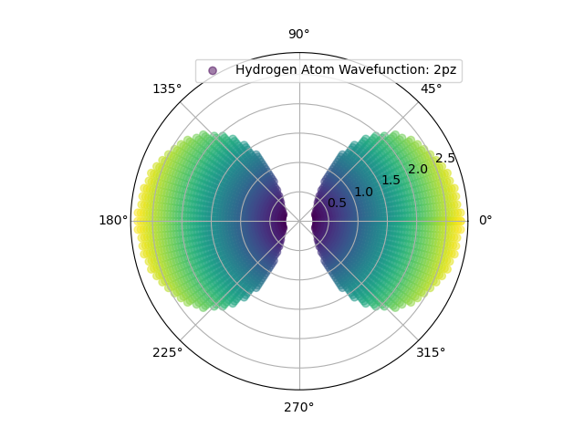
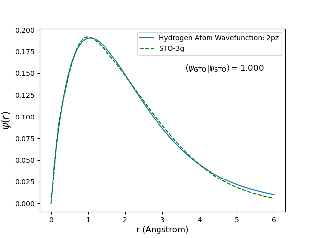

# Gaussian Basis Set Approximation of Hydrogenic Orbitals (STO-nG Model)

## General Info 

This Educational Program allows for generation visualization of the following Hydrogenic and STO-nG Orbitals:
1s, 2s, 2pz, 3s, 3pz, 3dz in the polar (r, theta, psi) and radial (r, psi) space. 

STO-nG orbitals are generated using a linear regression algorithm to optimize coefficients in the linear combination of Gaussians.
The in 'Radial' mode program will calculate and display numerical overlap integrals between STO-nG orbitals and Hydrogenic Orbitals

## Input Parameters

To run a simulation import the Basis class and create a Basis object with the following information:

    - Orbital of Interest
    - Number of Gaussians for STO-nG
    - Max Radial Span (optional)
    - Radial Step (optional)
    - Probabillity Threshold for Visualization
    - Plot Type (Radial or Polar)

## Graphing
The program can produce two types of graphs 'Radial': r vs psi and 'Polar': r vs theta graph. 

Polar:
    - Two separate plots for STO-nG and Hydrogenic Orbitals
    - Angular and Radial nodes for p and d like orbitals
    - Heat Map to visualize relative probabilty across the surface

Example 2pz: 

STO-3G

Hydrogenic 

Radial:
    - One plot with both STO-nG and Hydrogenic Orbitals
    - Includes Overlap Integral for STO-nG x Hydrogenic

Example 2pz:

